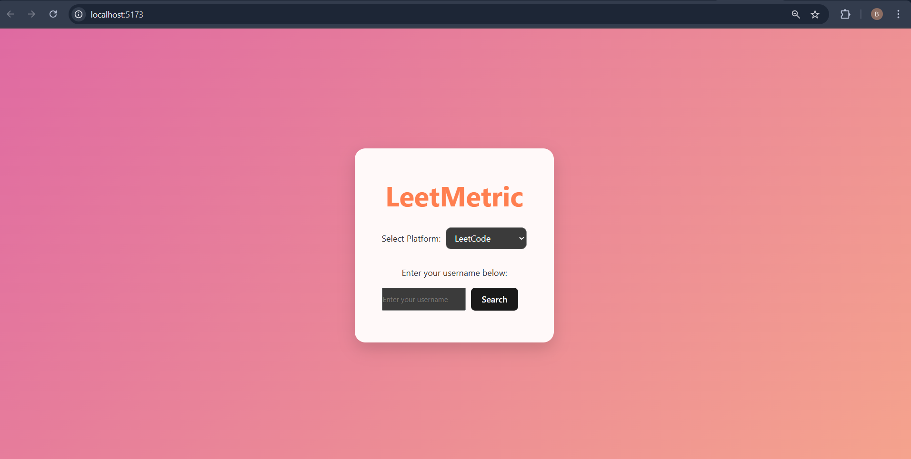
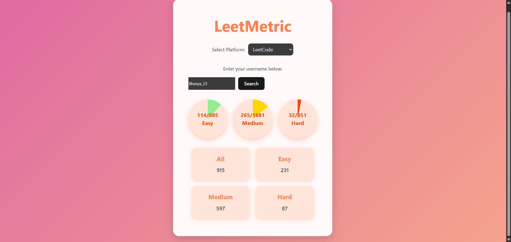

📊 LeetMetric
LeetMetric is a dynamic dashboard web application that visualizes a user’s coding performance and statistics on LeetCode and GeeksforGeeks. Built using the MERN stack (MongoDB, Express.js, React, Node.js), it fetches data via API and web scraping to deliver insightful visualizations like pie charts, line graphs, and bar charts.

🚀 Track your coding journey visually and stay motivated!

Screenshots
### 🏠 Home Page

### 📊 Stats Page

⚙️ Features
🔍 Username Input for LeetCode and GFG

📈 Dynamic Charts using Chart.js & Recharts

🎯 Coding Stats Visualization

Problems Solved

Difficulty-wise Distribution

Daily Progress

🧩 Platform Switch (LeetCode / GFG)

💡 Clean and Responsive UI with Tailwind CSS

🛠 Tech Stack
Frontend:

React.js

Tailwind CSS

Axios

Chart.js / Recharts

Backend:

Node.js

Express.js

Cheerio (for web scraping)

Axios

Other Tools:

Vite (React App bundler)

CORS Proxy (for LeetCode API access)

HOW TO RUN
1. Clone the Repo
bash
Copy
Edit
git clone https://github.com/shipfast10/Leetmetric.git
cd Leetmetric
2. Setup Server
bash
Copy
Edit
cd server
npm install
# Create a .env file and add necessary variables (if any)
npm start
3. Setup Client
bash
Copy
Edit
cd ../client
npm install
npm run dev
Client will run on http://localhost:3000, server on http://localhost:5000

Project Structure
bash
Copy
Edit
Leetmetric/
│
├── client/            # Frontend - React App
│   ├── src/
│   │   ├── components/
│   │   ├── assets/
│   │   ├── App.jsx
│   │   └── main.jsx
│
├── server/            # Backend - Node.js + Express
│   ├── routes/
│   ├── controllers/
│   ├── utils/
│   └── index.js
│
└── README.md

 How It Works
LeetCode data is fetched using GraphQL APIs via CORS proxy.

GFG stats are scraped using Cheerio from public profile pages.

Data is sent from Express backend to React frontend.

Charts are rendered using Recharts/Chart.js based on response.

Acknowledgements
LeetCode GraphQL API

GeeksforGeeks

Chart.js

Recharts

👤 Author
Bhavya Agarwal